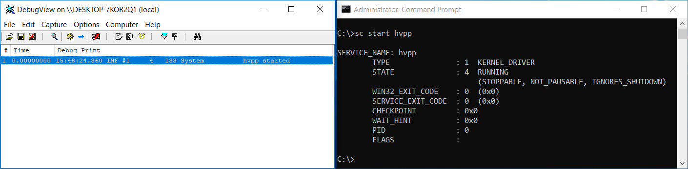
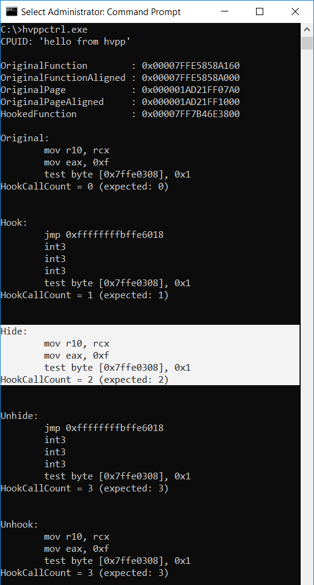
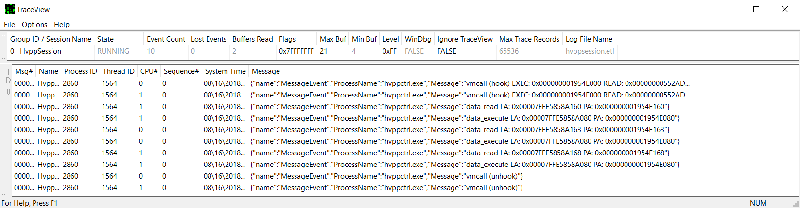
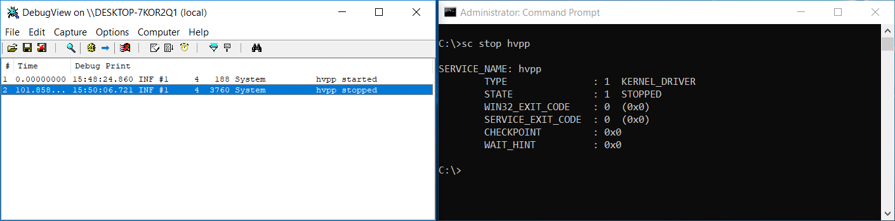

# hvpp

hvpp is a lightweight Intel x64/VT-x hypervisor written in C++ focused primarily on virtualization of already running
operating system.

### Motivation

[Although][simplevisor] [several][hyperplatform] [open-source][hyperbone] [research][bareflank] [hypervisors][ksm]
[aimed][more] [at][hyperdbg] [simplicity][virtdbg] [already][bluepill] [exist][phrack], in my opinion this field is
still somewhat unexplored and needs more open-source projects. This can especially help those who have just
started exploring virtualization technologies and are looking for small/reference projects. If you're one of them, my
bets are that you're really disappointed right now, because all you've got are barely dozen of (great!) projects and
huge pile of Intel Manual pages.

C++ has been chosen as a language for this project because of two reasons:
- The virtualization architecture can be better expressed in OOP concepts (with such objects as VCPU, EPT).
- I didn't find other projects which would use modern C++17 features, except for [bareflank][bareflank]. Although
  bareflank is compilable under Windows, Linux and UEFI, on Windows, it uses cygwin to cross-compile the hypervisor. Since the hypervisor is a self contained ELF binary, the Windows kernel is missing the debug symbols for the hypervisor, which prevents easy debugging with WinDbg.

Even though this project is primarily developed for Windows, I've decided to not use traditional _Windows Driver naming
convention_ (aka `DrvCamelCase`). Instead, traditional C++ `snake_case` is used. The reason is that hypervisor is very
"stand-alone" and doesn't depend on many OS functions. Therefore I decided to treat it as a regular C++ project.

If you want to challenge yourself in low-level programming, my advice would be to try and write a simple hypervisor.
During the process you'll get invaluable knowledge and experience and you'll probably discover many new things.
For instance here's a selection of some things I've learned thanks to writing this project:
- what are [MTRR][mtrr] good for
- NT APIs like
  - `MmGetPhysicalMemoryRanges()` (and `\REGISTRY\MACHINE\HARDWARE\RESOURCEMAP`)
  - `KeIpiGenericCall` - which can be used instead of undocumented `KeGenericCallDpc` (but at the cost of higher IRQL)
- that [TraceLogging][tracelogging-api] API (built upon [ETW][etw-api]) exist
- [how Meltdown vulnerability has been mitigated in Windows][meltdown-mitigation]
- [that VMWare uses not only I/O port 0x5658][hyperplatform-issue30] for backdoor,
  [but also port 0x5659][vmware-backdoor1] and it uses almost all <abbr title="General Purpose">GP</abbr> registers
  [for both input and output parameters][vmware-backdoor2]
- that [bugs][fix-ksm1] [in][fix-ksm2] [other][fix-hyperplatform] [hypervisors][fix-simplevisor] exist (and found a
  way how to fix them)
- that VirtualBox [uses ring 1][virtualbox-ring1] for software-based virtualization (i.e. when VT-x/AMD-V
  isn't available)
- how guest memory [has been virtualized before EPT][shadow-paging] (by so called Shadow-paging, trapping
  page-faults and `mov cr3, <source>` instructions in the guest)


Also - as obvious as it might sound - I'd like to point out that if you decide to write your own VT-x hypervisor, you'll **NEED**
[Intel® 64 and IA-32 architectures software developer’s manual combined volumes: 1, 2A, 2B, 2C, 2D, 3A, 3B, 3C, 3D, and 4][intel-sdm].
So download the PDF - together with [Adobe Acrobat Reader][adobe-acrobat-reader] - because trust me, you don't want to
read and navigate through 5000 pages with browser's built-in PDF reader.

### Features

- EPT with identity mapping **with usage of 2MB pages** for the first 512GB of physical memory (see [ept.cpp](src/hvpp/hvpp/ept.cpp)).
  This results in faster translations of the memory. It also means splitting particular 2MB pages into 4kb pages might
  be desired if EPT hooking is required. This process is actually not complicated at all and this repository includes
  example on how to achieve that.
- Simple pass-through VM-exit handler, which can handle:
  - exceptions or [NMIs][nmi]
  - `CPUID`, `(WB)INVD`, `INVLPG`, `RDTSC(P)`, `MOV CR`, `MOV DR`, `IN/OUT`, `RDMSR`, `WRMSR`, `SGDT`, `SIDT`, `LGDT`,
    `LIDT`, `SLDT`, `STR`, `LLDT`, `LTR`, `XSETBV` and `INVPCID` instructions
  - `VMCALL` instruction (used for termination of **hvpp**)
  - `VMCLEAR`, `VMLAUNCH`, `VMRESUME`, `VMPTRLD`, `VMPTRST`, `VMREAD`, `VMWRITE`, `VMFUNC`, `VMXOFF`, `VMXON`, `INVEPT`
    and `INVVPID` instructions raise **#UD** (invalid opcode exception)
- Ability to run in VMWare (tested even with KVM - I advise to turn off [Hyper-V Enlightenments][kvm-hv-enlightenments],
  as it can [cause conflicts][ddimon-issue22]). VMWare's nested virtualization makes development and debugging of
  hypervisors much easier.
- Simple custom memory manager ([see mm.cpp](src/hvpp/hvpp/lib/mm.cpp)). The need for custom memory manager emerges from the
  fact that you should think twice before calling any kernel function from VM-exit handler, because many of them can be
  called at IRQL <= DISPATCH_LEVEL (such as `ExAllocatePoolWithTag`). But in VM-exit handler, interrupts are disabled
  and your [IRQL is effectively HIGH_LEVEL][irql-in-vmx].
- Detailed code comments, which should explain what the code does and why - sometimes with direct references to
  Intel Manual for further reading.
- [TraceLogging][tracelogging-api] API (which builds on ETW) - the main benefit is it can be used for **really** high
  frequency logging (10'000+ per second) and it can be used from any IRQL - which makes it a perfect candidate even
  for logging in VM-exit handlers.
  - **hvpp** already includes tracing VM-exit handler (see [vmexit_stats.cpp](src/hvpp/hvpp/vmexit/vmexit_stats.cpp)).
- Various reimplemented classes and functions - such as bitmaps and spinlocks - to avoid calling kernel functions.
- Included simple application (**hvppctrl**) which should demonstrate `CPUID` instruction interception, hiding hooks
  in user-mode applications via EPT and communication with **hvpp** via `VMCALL`

### Code workflow

> Note: **hvpp** is compiled as a static library, which is linked with the **hvppdrv** project.

- Bootstrap of the driver (hvpp, [driver.cpp](src/hvpp/hvpp/lib/win32/driver.cpp))
  - preallocate enough memory and initialize the **hvpp** memory manager
  - initialize the logger
- Bootstrap of the hypervisor (hvppdrv, [main.cpp](src/hvppdrv/main.cpp))
  - create **vmexit_handler** instance
- Start the hypervisor with provided VM-exit handler: `hypervisor::start(vmexit_handler& handler)`
  - initialize virtual cpu (VCPU) for each logical processor
  - assign provided `vmexit_handler` instance to each VCPU
  - launch all VCPUs via IPI (inter-processor interrupt): `vcpu_t::start()`
    - setup VMXON region and VMCS: `vcpu_t::vmx_enter()`
    - `vmexit_handler::setup()` is called, which allows anyone to initialize the VM-exit handler and/or modify the VMCS
      before the launch (see `vmexit_custom_handler::setup()` in hvppdrv, [vmexit_custom.cpp](src/hvppdrv/vmexit_custom.cpp))
- Hypervisor is now running and handling VM-exits via provided VM-exit handler
- Stop the hypervisor: `hypervisor::stop()`
  - destroy each VCPU via IPI: `vcpu_t::stop()`
    - `vmexit_handler::teardown()` is called and switches into VMX mode (`vmexit_passthrough_handler::teardown()` does
      it by `VMCALL` instruction)
    - in VMX mode, `vcpu_t::vmx_leave()` is called - it leaves VMX mode with `VMXOFF` instruction

### Compilation

Compile **hvpp** using Visual Studio 2017. Solution file is included. The only required dependency is [WDK][wdk].

### Usage

> You can run **hvpp** on Windows 7 or higher. Windows 10 is recommended though, because it supports **TraceLogging**.

Enable [Test-Signing][test-signing] boot configuration option (note that you'll need administrative privileges to use
`bcdedit` and `sc` commands):

`bcdedit /set testsigning on`

[Register driver][sc-create] with Service Control Manager (yes, it's important to leave these spaces):

`sc create hvpp type= kernel binPath= "C:\full\path\to\hvppdrv.sys"`

Now you should restart your computer for **testsigning** to take effect, otherwise you'll be unable to start the driver.
But before you do, you might want to prepare [DebugView][tools-debugview] from SysInternals and
[traceview.exe][tools-traceview] tool from the WDK (note that `traceview` will work properly only on Windows 10).

After restart, launch `DebugView` and `TraceView`. In `TraceView`:
- go to `File -> Create New Log Session`, click on `Add Provider`
  - pick `Manually Entered Control GUID or Hashed Name`
  - paste `916fcd3e-673b-4610-aaba-0b71e28acd40` (arbitrarily chosen, see [lib/win32/tracelog.cpp](src/hvpp/hvpp/lib/win32/tracelog.cpp))
  - click `OK`
- in the next dialog, leave the `Source Of WPP Format Information` set to `Auto`
  - click `OK`
- after that, click `Next`, which will bring you to `Log Session Options` dialog
  - in `Log Session Name` editbox you can give this logging session any name you like, e.g. `HvppSession` or you can
    leave it as it is
  - if you desire to analyze this logging session when it's stopped (e.g. with [Windows Performance Analyzer][tools-wpa])
    you can optionally enable `Log Trace Event Data To File`, which saves whole logging session into an `.ETL` file
  - click `Finish`

`TraceView` is now set-up and ready to show [tracelogs][tracelogging-api] from **hvpp**. You can launch **hvpp**
now:

`sc start hvpp`


hvpp now performs various checks and enters VMX mode if they pass. In case of success you should see message
`hvpp started` in the `DebugView`.

<p align="center">
  
</p>

Run **hvppctrl**:

`hvppctrl.exe`


- **hvppctrl** performs `CPUID` instruction with `EAX = 0x70707668 ('hvpp')` which **hvpp** should intercept and return
  string `hello from hvpp` in EAX, EBX, ECX and EDX registers (see [vmexit_custom.cpp](src/hvppdrv/vmexit_custom.cpp)).
  **hvppctrl** should print this string.

- **hvppctrl** tries to "stealthily" hook `ntdll!ZwClose` function using EPT. The exact process is described
  further below.

- **hvppctrl** performs IOCTL, which should instruct **hvpp** to set one-time breakpoint when `IN/OUT` instruction
  manipulating with port `0x64` (keyboard) is executed.


#### Description of "stealth hooking" process

- locates `ZwClose` function in **ntdll.dll**
  - disassembles first 16 bytes of this function and prints them
    - printed instructions should indicate that this function is **NOT** hooked yet
  - calls this function (with `NULL` parameter, this function call will most likely fail with some NTSTATUS error code,
    which it ignores)
  - prints value of `HookCallCount` and it's expected value (explained below)
- hooks `ntdll!ZwClose` fuction using [Detours][detours]
  - disassembles first 16 bytes of this function and prints them
    - printed instructions should now indicate that the function **IS** hooked (by `jmp` being first instruction)
  - calls this function (with `NULL` parameter)
    - instead of original function, the hook function will be called - on each call, it increments variable
      `HookCallCount`
  - prints value of `HookCallCount` and it's expected value - it should be 1 now, as the hooked function has been called
    for the first time now
- calls **hvpp** by `VMCALL` instruction and `RCX = 0xc1` (arbitrarily chosen), `RDX = AddressOfReadPage` and
  `R8 = AddressOfExecutePage` - this instructs **hvpp** to hide the hook
  - disassembles first 16 bytes of this function and prints them
    - printed instructions should now indicate that the function hook is **HIDDEN** (by showing original content of
      memory - no `jmp`)
  - calls this function (with `NULL` parameter)
    - despite what the memory returned when we read it, the hook function will be called again and the `HookCallCount`
      will be incremented again
  - prints value of `HookCallCount` and it's expected value - it should be 2
- calls **hvpp** by `VMCALL` instruction and `RCX = 0xc2` (arbitrarily chosen) - this instructs **hvpp** to unhide the
  hook
  - disassembles first 16 bytes of this function and prints them
    - printed instructions should now indicate that the function hook is **NOT HIDDEN** and it should show `jmp` as a
      first instruction again
  - calls this function (with `NULL` parameter)
    - because the function is still hooked, the hook function will be called and `HookCallCount` will be incremented
      again
  - prints value of `HookCallCount` and it's expected value - it should be 3
- unhooks `ntdll!ZwClose` function
  - disassembles first 16 bytes of this function and prints them
    - printed instructions should now indicate that the function is **NOT** hooked - it should show the same content
      as when this function wasn't hooked
  - calls this function (with `NULL` parameter)
    - original function will be called, therefore the `HookCallCount` should not be incremented now
  - prints value of `HookCallCount` and it's expected value - it should be still 3

<p align="center">
  
</p>

At the same time you should see tracelog messages in the `TraceView` - they are generated on each `VMCALL` and on each
_EPT Violation_.

<p align="center">
  
</p>

When you decide you want to turn off the **hvpp**, just execute:

`sc stop hvpp`

<p align="center">
  
</p>

### Remarks

- **hvpp** is designed to virtualize already running OS - i.e. it's not capable of running multiple guests like VMWare
  or VirtualBox. It also lacks support for any nested VMX operations.
- **hvpp** is designed to run only on 64bit Intel processors, which support VT-x and EPT. This makes the code more
  simple and less bloated.
- **hvpp** is designed to run only on Windows - future work might focus on Linux.
- **hvpp** currently doesn't exit VMX mode on sleep or hibernate ([S3 and S4][global-states] power states) - Intel
  Manual says we should do so - this is known limitation.

### License

This software is open-source under the MIT license. See the LICENSE.txt file in this repository.

[Detours][detours] is licensed under MIT license (a copy of the license is included
[here](src/hvppctrl/detours/LICENSE.md)).

[udis86][udis86] is licensed under the terms of the 2-clause "Simplified BSD License" (a copy of the license is included
[here](src/hvppctrl/udis86/LICENSE.txt)).


### Similar work

**SimpleVisor:**            https://github.com/ionescu007/SimpleVisor

**HyperPlatform:**          https://github.com/tandasat/HyperPlatform

**HyperBone:**              https://github.com/DarthTon/HyperBone

**Bareflank:**              https://github.com/Bareflank/hypervisor

**ksm:**                    https://github.com/asamy/ksm

**MoRE:**                   https://github.com/ainfosec/MoRE

**hyperdbg:**               https://github.com/rmusser01/hyperdbg

**virtdbg:**                https://github.com/upring/virtdbg

**BluePill:**               https://invisiblethingslab.com/resources/bh07/nbp-0.32-public.zip

**Phrack #69:**             http://www.phrack.org/issues/69/15.html

**NOVA Microhypervisor:**   https://github.com/udosteinberg/NOVA

Finally, I'd especially like to suggest reading interesting writings from Satoshi Tanda ([github](https://github.com/tandasat), [twitter](https://twitter.com/standa_t)):
- http://tandasat.github.io/HyperPlatform/
- http://tandasat.github.io/HyperPlatform/userdocument/index.html
- http://standa-note.blogspot.com/2015/08/writing-hypervisor-for-kernel-mode-code.html

And notes from LordNoteworthy ([github](https://github.com/LordNoteworthy), [twitter](https://twitter.com/LordNoteworthy)):
- https://github.com/LordNoteworthy/cpu-internals
- https://github.com/LordNoteworthy/windows-internals

If you find this project interesting, you can buy me a coffee

```
  BTC 3GwZMNGvLCZMi7mjL8K6iyj6qGbhkVMNMF
  LTC MQn5YC7bZd4KSsaj8snSg4TetmdKDkeCYk
```

  [simplevisor]: <https://github.com/ionescu007/SimpleVisor>
  [hyperplatform]: <https://github.com/tandasat/HyperPlatform>
  [hyperbone]: <https://github.com/DarthTon/HyperBone>
  [bareflank]: <https://github.com/Bareflank/hypervisor>
  [ksm]: <https://github.com/asamy/ksm>
  [more]: <https://github.com/ainfosec/MoRE>
  [hyperdbg]: <https://github.com/rmusser01/hyperdbg>
  [virtdbg]: <https://github.com/upring/virtdbg>
  [bluepill]: <https://invisiblethingslab.com/resources/bh07/nbp-0.32-public.zip>
  [phrack]: <http://www.phrack.org/issues/69/15.html>
  [virtualbox]: <http://virtualbox.org/svn/vbox/trunk/>
  [kvm]: <https://github.com/torvalds/linux/tree/master/arch/x86/kvm>
  [xen]: <https://github.com/xen-project/xen>
  [wdk]: <https://docs.microsoft.com/en-us/windows-hardware/drivers/download-the-wdk>
  [cpu-internals]: <https://github.com/LordNoteworthy/cpu-internals>
  [meltdown-mitigation]: <https://blogs.technet.microsoft.com/srd/2018/03/23/kva-shadow-mitigating-meltdown-on-windows/>
  [vmware-backdoor1]: <https://www.thezdi.com/blog/2017/8/1/pythonizing-the-vmware-backdoor>
  [vmware-backdoor2]: <https://sites.google.com/site/chitchatvmback/backdoor>
  [hyperplatform-issue30]: <https://github.com/tandasat/HyperPlatform/issues/30#issuecomment-410556512>
  [fix-ksm1]: <https://github.com/asamy/ksm/issues/25>
  [fix-ksm2]: <https://github.com/asamy/ksm/issues/26>
  [fix-hyperplatform]: <https://github.com/tandasat/HyperPlatform/commit/e28bec261238b3e1dd469138e4f458a2a91c2318>
  [fix-simplevisor]: <https://github.com/ionescu007/SimpleVisor/pull/32>
  [virtualbox-ring1]: <https://www.virtualbox.org/manual/ch10.html#idm10925>
  [shadow-paging]: <https://stackoverflow.com/a/14177130/2083309>
  [test-signing]: <https://docs.microsoft.com/en-us/windows-hardware/drivers/install/the-testsigning-boot-configuration-option>
  [sc-create]: <https://resources.infosecinstitute.com/loading-the-windows-kernel-driver/>
  [tools-debugview]: <https://docs.microsoft.com/en-us/sysinternals/downloads/debugview>
  [tools-traceview]: <https://docs.microsoft.com/en-us/windows-hardware/drivers/devtest/traceview>
  [tools-wpa]: <https://docs.microsoft.com/en-us/windows-hardware/test/wpt/windows-performance-analyzer>
  [etw-api]: <https://docs.microsoft.com/en-us/windows-hardware/drivers/devtest/adding-event-tracing-to-kernel-mode-drivers#7-test-the-driver-to-verify-etw-support>
  [tracelogging-api]: <https://docs.microsoft.com/en-us/windows-hardware/drivers/devtest/tracelogging-api>
  [detours]: <https://github.com/Microsoft/Detours>
  [udis86]: <https://github.com/vmt/udis86>
  [adobe-acrobat-reader]: <https://get.adobe.com/reader/>
  [intel-sdm]: <https://software.intel.com/en-us/articles/intel-sdm>
  [irql-in-vmx]: <https://github.com/tandasat/HyperPlatform/issues/3#issuecomment-230494046>
  [nmi]: <https://en.wikipedia.org/wiki/Non-maskable_interrupt>
  [mtrr]: <https://en.wikipedia.org/wiki/Memory_type_range_register>
  [kvm-hv-enlightenments]: <https://scottlinux.com/2016/03/21/enable-hyper-v-enlightenments-in-kvm-for-better-windows-vm-performance/>
  [ddimon-issue22]: <https://github.com/tandasat/DdiMon/issues/22#issuecomment-408419200>
  [global-states]: <https://en.wikipedia.org/wiki/Advanced_Configuration_and_Power_Interface#Global_states>
