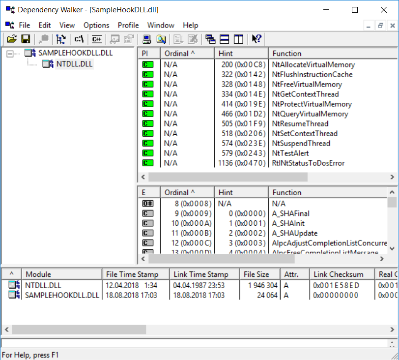
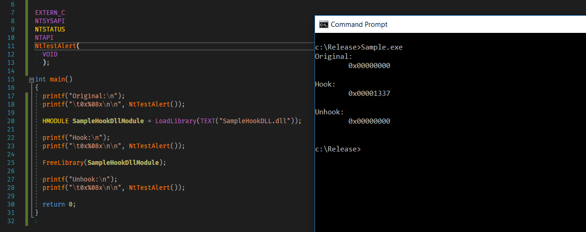

# DetoursNT

DetoursNT is a simple project with one goal - make Detours dependent only on `NTDLL.DLL` without any modifications of
the original code.

### Why?

- Because this way you can hook native processes.
- Because this way you can load your hooking library **right after** load of `NTDLL.DLL`
  - This can be achieved in many ways - for example using Windows Driver via so-called APC injection.
    You can look at my project [injdrv][injdrv] to get an idea about how is this done.

### How?

This repository has attached original git repository of Detours from Microsoft as a submodule.
Therefore, the original code hasn't been touched in any way.

NTDLL-only dependency been achieved by creating a C header file [DetoursNT.h](DetoursNT/DetoursNT.h) which has
been force-included (`/FI` switch of MSVC) into every compilation unit of Detours. This header
mocks functions of `KERNEL32.DLL` to custom implementation defined in [DetoursNT.cpp](DetoursNT/DetoursNT.cpp).

I'd like to thank authors of following projects:
- [ReactOS][reactos] - used for implementation of `KERNEL32.DLL` functions
- [ProcessHacker][processhacker] - used for prototypes of `NTDLL.DLL` functions

### Compilation

Because original Detours source code is attached as a git submodule, you must not forget to fetch it:

`git clone --recurse-submodules https://github.com/wbenny/DetoursNT`

After that, compile **DetoursNT** using Visual Studio 2017. Solution file is included. No other dependencies are required.

### Usage

After you hit `F7` in Visual Studio and have everything compiled, you can check that `SampleHookDLL.dll`
indeed depends only on `NTDLL.DLL`:



This hooking DLL only hooks `NtTestAlert` function for demonstrative purposes. In this repository there is also
`Sample` project. It's only purpose is to call `LoadLibrary(TEXT("SampleHookDLL.dll"))`, `NtTestAlert()` and
`FreeLibrary()` to show you that the hook is working.



### Remarks

- This implementation intentionally crashes on SEH exceptions which occur inside of Detours. This is because SEH
  handlers are usually located in CRT (which is ommited here).
- Only x86 and x64 is currently supported.


### License

This software is open-source under the MIT license. See the LICENSE.txt file in this repository.

[Detours][detours] is licensed under MIT license (a copy of the license is included in separate git submodule)

If you find this project interesting, you can buy me a coffee

```
  BTC 12hwTTPYDbkVqsfpGjrsVa7WpShvQn24ro
  LTC LLDVqnBEMS8Tv7ZF1otcy56HDhkXVVFJDH
```

  [detours]: <https://github.com/Microsoft/Detours>
  [injdrv]: <https://github.com/wbenny/injdrv>
  [reactos]: <https://www.reactos.org/>
  [processhacker]: <https://github.com/processhacker/processhacker/tree/master/phnt/include>